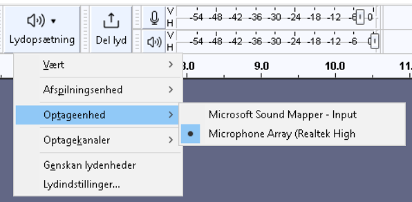

# Læg din egen lyd ind i Minecraft

# Optag lyd med [Audacity](https://www.audacityteam.org/)
 - Start programmet: tryk på windows tasten og skriv audacity
 - Vælg optageenhed

.

 - brug optage knappen til at optage med
 - gem optagelsen ved at eksportere: _Fil -> Eksporter lyd... CTRL-SHIFT-E_
 - Vælg Format: Ogg Vorbis-filer

# Ændre minecraft pakke

# Teste minecraft pakke

# Ny version af minecraft pakke
